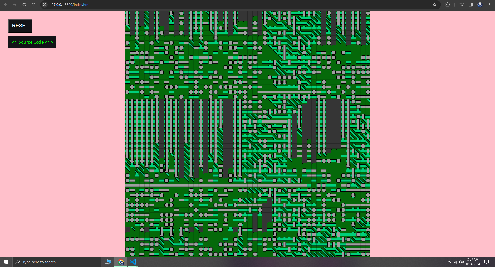
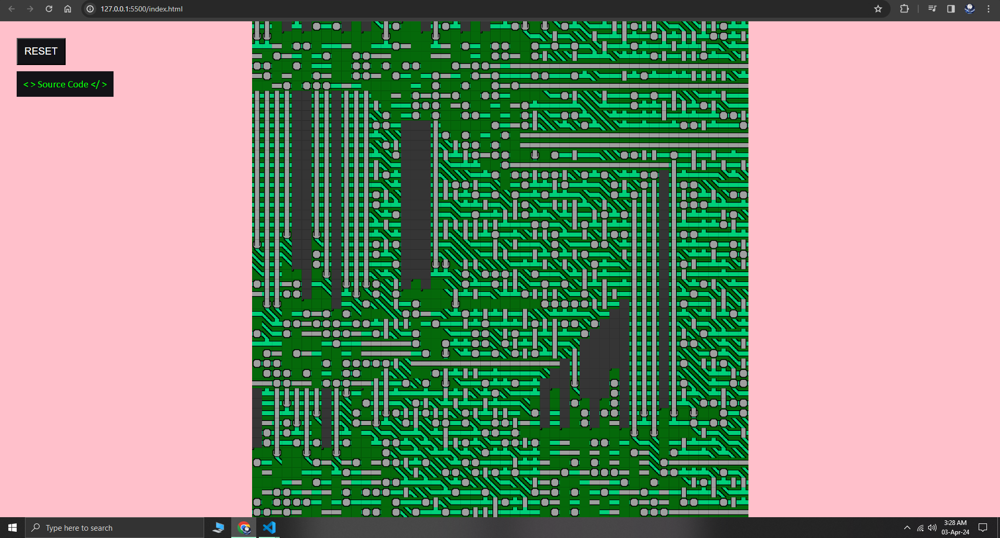

# Wave_Function_Collapse
A very very simple implementation of the famous Wave Function Collapse algorithm in Javascript.

where I learnt about it: https://youtu.be/rI_y2GAlQFM?si=IZGZe5m3ymhl5isW

some generated images:

